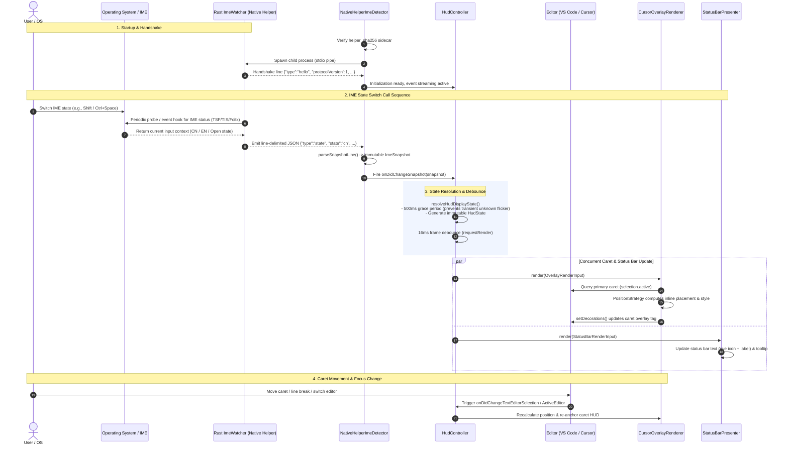

<p align="center">
  
</p>

<h1 align="center">Cursor IME HUD</h1>

<p align="center">
  Chinese / English IME state, next to your caret<br>
  for <strong>VS Code</strong>, <strong>Cursor</strong>, and <strong>JetBrains IDEs</strong>
</p>

<p align="center">
  <a href="https://github.com/GJYNBB/cursor-ime-hud/releases"></a>
  <a href="https://code.visualstudio.com/"></a>
  <a href="https://www.jetbrains.com/"></a>
  <a href="LICENSE"></a>
</p>

<p align="center">
  <a href="README.md">简体中文</a> · English
</p>

---

You mean to type English. A string of pinyin appears instead.

**Cursor IME HUD** shows the current Chinese / English input state next to the primary caret and mirrors it in the status bar. It indicates only — it never switches IME, and it never reads what you type.

## Preview

<table>
  <tr>
    <td align="center" width="50%">
      <strong>VS Code / Cursor</strong><br>
      
    </td>
    <td align="center" width="50%">
      <strong>JetBrains</strong><br>
      
    </td>
  </tr>
</table>

## Features

- **Caret HUD** — compact `中` / `英` or `ZH` / `EN` next to the primary caret
- **Status bar** — persistent eye + `输入法：中` / `英` / `?` (eye reflects caret-icon on/off live); hover to click-toggle the caret icon or open settings
- **Two render modes** — icon + text, or text only
- **Cross-platform** — Windows / macOS / Linux via a dedicated Rust native helper
- **Stable under noise** — short `unknown` bursts keep the last stable state; manual refresh can recover helper failures
- **Privacy first** — no file reads, no clipboard, no keystroke logging, no upload of input

## Support

| Area         | Status                                                  |
| ------------ | ------------------------------------------------------- |
| Editors      | VS Code `^1.107.0`, Cursor, JetBrains IDEs `2026.1+`    |
| OS           | Windows 10/11, macOS, Linux                             |
| Arch         | x64 / arm64                                             |
| IME scope    | Primarily Chinese IMEs; reports unknown when unreliable |
| Multi-cursor | Primary caret only                                      |
| Auto-switch  | **Not supported** and never performed                   |

## Install

Download from [GitHub Releases](https://github.com/GJYNBB/cursor-ime-hud/releases):

| Client                               | Artifact                                   |
| ------------------------------------ | ------------------------------------------ |
| VS Code / Cursor                     | `cursor-ime-hud-<version>-<platform>.vsix` |
| VS Code / Cursor (universal offline) | `cursor-ime-hud-<version>.vsix`            |
| JetBrains                            | `cursor-ime-hud-jetbrains-<version>.zip`   |

Platform suffixes: `win32-x64`, `win32-arm64`, `darwin-x64`, `darwin-arm64`, `linux-x64`, `linux-arm64`.

### VS Code / Cursor

```bash
code --install-extension ./cursor-ime-hud-<version>-win32-x64.vsix
# or
cursor --install-extension ./cursor-ime-hud-<version>-win32-x64.vsix
```

You can also use **Install from VSIX…** in the Extensions view.

### JetBrains

**Settings → Plugins → gear → Install Plugin from Disk…**, then pick the ZIP.

> Released packages already include the native helper. No Rust or build tools are required to install.

## Quick start

1. Install the extension/plugin and reload the IDE
2. Open an editable file and place the caret in the editor
3. Toggle Chinese / English input mode
4. Watch the caret label and status bar

Default labels are `中 / 英`; switch to `ZH / EN` in settings if you prefer Latin labels.

## Configuration

### VS Code / Cursor

| Setting                                        | Default     | Description                           |
| ---------------------------------------------- | ----------- | ------------------------------------- |
| `cursorImeHud.overlay.enabled`                 | `true`      | Show the caret HUD                    |
| `cursorImeHud.overlay.labelPreset`             | `zh-en`     | `zh-en` → 中/英; `en-zh` → ZH/EN      |
| `cursorImeHud.overlay.mode`                    | `text+icon` | `text+icon` or `text`                 |
| `cursorImeHud.overlay.cnColor`                 | `#FF5252`   | Chinese accent color                  |
| `cursorImeHud.overlay.enColor`                 | `#1E90FF`   | English accent color                  |
| `cursorImeHud.overlay.opacity`                 | `0.78`      | Overall HUD opacity (0.15–1)          |
| `cursorImeHud.overlay.backgroundEnabled`       | `true`      | Background in text-only mode          |
| `cursorImeHud.overlay.backgroundOpacity`       | `0.72`      | Background / tile fill opacity        |
| `cursorImeHud.overlay.offsetX`                 | `6`         | Horizontal offset (−50 ~ 50)          |
| `cursorImeHud.overlay.offsetY`                 | `20`        | Vertical offset (−50 ~ 50)            |
| `cursorImeHud.overlay.hideWhenEditorUnfocused` | `true`      | Hide HUD when the window is unfocused |
| `cursorImeHud.statusBar.enabled`               | `true`      | Show the status bar item              |

### JetBrains

The plugin exposes the same core options: HUD / status bar toggles, label preset, colors, opacity, offsets, and hide-on-blur.

## Commands

| Command           | Action                                              |
| ----------------- | --------------------------------------------------- |
| Toggle Overlay    | Show / hide the caret HUD                           |
| Refresh IME State | Force a re-detect; can recover after helper failure |
| Show Diagnostics  | Detector, lifecycle, and recent logs                |

Hover the status bar item to click-toggle the caret icon or open settings.

## Privacy & security

This project only needs to know _Chinese or English_ — never _what you typed_.

- Does not read editor file contents
- Does not read the clipboard
- Does not log or upload keystrokes or typed text
- Does not change system IME state
- The helper queries public platform / IME APIs and returns structured state over stdio
- Helper binaries are verified with `.sha256` sidecars before use

Details:

- [docs/helper-protocol.md](docs/helper-protocol.md)
- [docs/helper-lifecycle.md](docs/helper-lifecycle.md)
- [SECURITY.md](SECURITY.md)

## Repository layout

```text
cursor-ime-hud/
├── src/           # VS Code / Cursor extension (TypeScript)
├── native/        # Cross-platform IME helper (Rust)
├── jetbrains/     # JetBrains plugin (Kotlin)
├── resources/     # Icons, screenshots, packaged helpers
├── docs/          # Protocol & lifecycle docs
└── scripts/       # Build & packaging scripts
```

## Architecture & Call Sequence

### 1. System Architecture

The project adopts a decoupled architecture consisting of **IDE Frontend Plugins** and an **Independent Native Helper Daemon**. It supports both VS Code / Cursor (TypeScript) and JetBrains IDEs (Kotlin), communicating with the cross-platform Rust native helper via a line-delimited JSON IPC protocol over `stdio`:

```mermaid
graph TB
    subgraph Host["IDE Host Layer"]
        subgraph VSCodeExt["VS Code / Cursor Extension (TypeScript)"]
            Entry["extension.ts / Composition.ts<br/>(Composition Root / Lifecycle)"]
            
            subgraph ControllerLayer["Controller Layer"]
                Controller["HudController<br/>(Debounce / Grace Period / State Resolver)"]
                EditorHost["VSCodeEditorHost<br/>(Caret / Selection / Focus Events)"]
            end

            subgraph DetectorLayer["Detector Layer"]
                Selector["SampleOrNativeDetector<br/>(Fallback & Lifecycle Wrapper)"]
                NativeDetector["NativeHelperImeDetector<br/>(Process Mgr / SHA-256 / IPC)"]
                SampleDetector["SampleImeDetector<br/>(Safe Fallback)"]
            end

            subgraph PresenterLayer["Presenter & Renderer Layer"]
                OverlayRenderer["CursorOverlayRenderer<br/>(Caret Overlay / Style Cache)"]
                PosStrategy["PositionStrategy<br/>(Inline Caret Placement)"]
                StatusBar["StatusBarPresenter<br/>(Status Bar Item & Hover Menu)"]
            end

            subgraph ServiceLayer["Services & Model Layer"]
                Settings["SettingsService<br/>(Debounced Config Listener)"]
                Logger["LoggerService<br/>(Diagnostics & Output Logging)"]
            end
        end

        subgraph JetBrainsPlugin["JetBrains Plugin (Kotlin)"]
            JBAppService["ImeHelperAppService<br/>(Helper Process Singleton)"]
            JBCaretController["CaretHudController<br/>(Caret HUD Controller)"]
            JBRenderer["CaretHudRenderer<br/>(Inlay / Editor Painter)"]
            JBStatusBar["ImeStatusBarWidget<br/>(Status Bar Component)"]
        end
    end

    subgraph NativeHelper["Native OS Probe Layer (Rust - ImeWatcher)"]
        HelperMain["main.rs / protocol.rs<br/>(CLI & Periodic Probe Loop)"]
        subgraph OSAdapters["Platform Probes"]
            WinProbe["Windows (TSF / Imm32 / Win32)"]
            MacProbe["macOS (TIS / Carbon APIs)"]
            LinuxProbe["Linux (Fcitx5 / IBus / XKB / DBus)"]
        end
    end

    %% IPC Connections
    NativeDetector <== "Stdio JSON IPC (Line-delimited JSON)" ==> HelperMain
    JBAppService <== "Stdio JSON IPC" ==> HelperMain

    HelperMain --> WinProbe
    HelperMain --> MacProbe
    HelperMain --> LinuxProbe

    Entry --> Controller
    EditorHost -->|"Caret & Focus Events"| Controller
    Settings -->|"Settings Change"| Controller
    
    Selector --> NativeDetector
    Selector --> SampleDetector
    NativeDetector -->|"ImeSnapshot"| Selector
    Selector -->|"ImeSnapshot"| Controller
    
    Controller -->|"HudState / OverlayRenderInput"| OverlayRenderer
    OverlayRenderer --> PosStrategy
    Controller -->|"StatusBarRenderInput"| StatusBar
```



### 2. Runtime Call Sequence

End-to-end data flow and rendering lifecycle from an OS-level IME state switch to caret overlay and status bar updates:



JetBrains-specific notes: [jetbrains/README.md](jetbrains/README.md).

- [SignPath Code Signing Policy](docs/SIGNPATH_CODE_SIGNING_POLICY.md)

## Development

Requires Node.js 24+, npm 11+, Rust stable; MSVC on Windows, Xcode CLT on macOS; JDK 21 for JetBrains.

```bash
npm install
npm run compile
npm run lint
npm test

npm run build:helper
npm run package:vsix:target -- --target win32-x64 --out-dir dist/vsix

./jetbrains/gradlew -p jetbrains test
./jetbrains/gradlew -p jetbrains buildPlugin
```

Contribution guide and architecture:

- [CONTRIBUTING.md](CONTRIBUTING.md)
- [ARCHITECTURE.md](ARCHITECTURE.md)

## Troubleshooting

| Symptom                 | What to try                                                                                       |
| ----------------------- | ------------------------------------------------------------------------------------------------- |
| No HUD                  | Caret must be in editable text; HUD may be disabled; run Show Diagnostics                         |
| Status bar stuck on `?` | Window may not be a valid IME context, or helper cannot read state; try Refresh IME State         |
| Helper fails to start   | Install the official package for your arch; do not replace the helper or `.sha256` by hand        |
| Linux detection issues  | Ensure Fcitx / IBus / XKB (etc.) is available in the session; diagnostics show the active backend |

See [docs/ime-compatibility.md](docs/ime-compatibility.md) (Chinese) for what each IME/platform combination can and cannot detect, and the confidence attached to each signal.

When filing an issue, include IDE version, OS/arch, IME name, diagnostics (paths redacted), and whether it reproduces reliably.

## License

[MIT](LICENSE)
